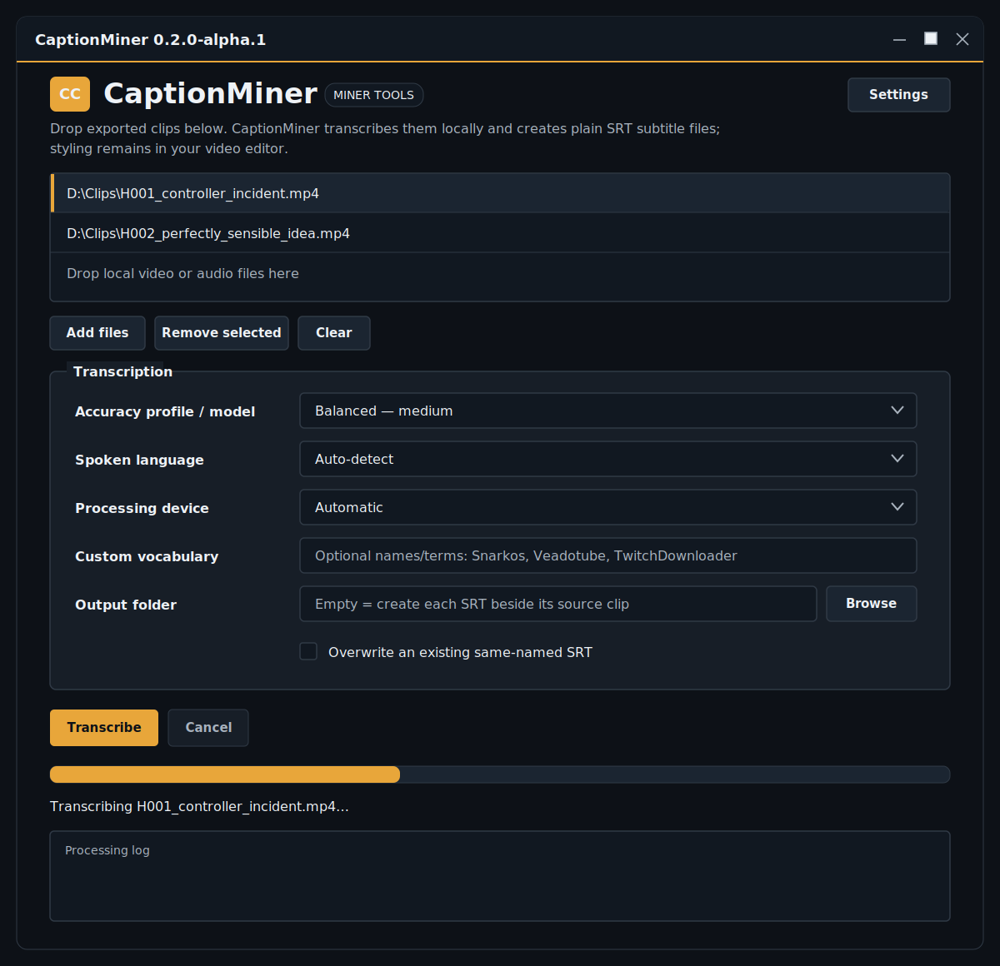

# ⛏️ CaptionMiner

**Local video/audio transcription to plain SRT subtitles for DaVinci Resolve, Adobe Premiere Pro, and CapCut.**

CaptionMiner takes one or more local media files, transcribes their speech with `faster-whisper`, and writes a matching `.srt` subtitle file for each source. It does not style captions, modify the media, upload content, or decide how subtitles should look. Styling remains where it belongs: in the video editor and under the user's control.

> **Status:** early alpha / v0.1.0. The transcription pipeline, SRT writer, CLI, desktop GUI, and repeatable portable Windows build are implemented. A real CaptionMiner SRT has been imported successfully into all three target Windows desktop editors. Clean-machine builds and broader editor-version combinations still need testing.

## What CaptionMiner does

```text
exported_clip.mp4
        │
        ▼
  CaptionMiner
        │
        ▼
exported_clip.srt
```

The source clip is read but never changed. The output SRT contains only:

1. A sequential cue number.
2. A media-relative start timestamp.
3. A media-relative end timestamp.
4. Plain transcribed text.

Example:

```srt
1
00:00:00,420 --> 00:00:02,180
Apparently this is a perfectly sensible idea.

2
00:00:02,310 --> 00:00:04,760
Nothing has caught fire yet.
```

There are no font instructions, colors, sizes, positions, animations, backgrounds, speaker colors, karaoke tags, or editor-specific effects in the file.

---

## Intended workflow with HighlightMiner

The initial standalone workflow is deliberately simple:

```text
HighlightMiner
└── exports H001_example.mp4
                  │
                  ▼
             CaptionMiner
                  │
                  └── creates H001_example.srt
```

Import the MP4 and SRT into the editor and place them at the same timeline start. Because the exported clip and its SRT both begin at `00:00:00`, their timing matches without knowing the clip's original position inside the full VOD.

CaptionMiner's transcription engine is separate from its GUI so it can later be called directly by HighlightMiner. A deeper integration should eventually reuse HighlightMiner's full-VOD word timestamps, select only the words inside an exported clip, and rebase those timestamps to zero. That will avoid running Whisper a second time.

---

## Compatibility target

CaptionMiner writes standard SubRip `.srt` files using:

- numeric cue identifiers
- `HH:MM:SS,mmm` timestamps
- `-->` time-range separators
- plain UTF-8 text
- CRLF line endings
- monotonically ordered, non-overlapping cue times

| Editor | SRT import | Manual test (Windows) | CaptionMiner target | Notes |
|---|---|---|---|---|
| DaVinci Resolve | Yes | Passed on Windows | Plain subtitle track / transcription import | Match the subtitle and clip timeline start. |
| Adobe Premiere Pro | Yes | Passed on Windows | Imported caption track | Import the SRT as media and place it in the sequence. |
| CapCut Desktop | Yes | Passed on Windows | Imported local captions | Import through Captions/Local captions. UI wording can change by version. |
| CapCut Web | Yes | Not tested | Imported local captions | Availability may depend on the current web interface. |
| CapCut Mobile | No direct SRT import as of January 2026 | Not tested | Not currently targetable | Create/import captions on Desktop or Web instead. |

### Manual desktop-editor validation

In the initial desktop-editor validation pass, one real HighlightMiner-exported video and its CaptionMiner-generated SRT were imported manually into the user's installed Windows desktop copies of:

- DaVinci Resolve
- Adobe Premiere Pro
- CapCut Desktop

All three editors created separate, timed subtitle or caption cues on their timelines. Caption text remained editable and presentation styling remained controlled by the editor. This validates the generated SRT structure and media-relative cue timing for that field-tested setup.

The exact editor build numbers were not recorded during this first test. The result therefore means **confirmed working on the tested Windows machine**, not certified for every past or future release. Future validation reports should record the editor name and exact version, Windows version, CaptionMiner version or commit, test date, and whether import, cue timing, editing, and styling all behaved correctly.

Official editor documentation:

- Adobe Premiere Pro — importing third-party caption files: https://helpx.adobe.com/premiere/desktop/add-text-images/insert-captions/import-caption-file-from-third-party-service.html
- DaVinci Resolve 19 New Features Guide — SRT transcription import/export: https://documents.blackmagicdesign.com/SupportNotes/DaVinci_Resolve_19_New_Features_Guide.pdf
- CapCut — importing subtitle files: https://www.capcut.com/help/how-to-import-subtitles

Compatibility means that the editors can import CaptionMiner's SRT structure. It does not mean every historical or future editor release has been individually certified. If an editor changes its import behavior, open an issue with the editor name and exact version, Windows version, CaptionMiner version or commit, and a minimal non-sensitive SRT that reproduces the problem.

---

## Features

- **Local transcription** — media stays on the machine running CaptionMiner.
- **Video and audio input** — PyAV decodes formats supported by its bundled FFmpeg libraries.
- **No separate FFmpeg install** — `faster-whisper` uses PyAV, which ships FFmpeg libraries in its Python package.
- **NVIDIA GPU support** — CTranslate2 uses CUDA when available.
- **Automatic CPU fallback** — Automatic mode retries on CPU when CUDA initialization fails.
- **Batch processing** — drag in multiple exported clips and reuse one loaded model across the batch.
- **Honest progress reporting** — unmeasurable phases animate instead of pretending to be stuck at 0%, followed by timestamp-based batch progress and elapsed time.
- **Word-level timestamps** — subtitle boundaries are derived from recognized word timing.
- **Focused gap recovery** — quality profiles independently retry suspicious transcript gaps and merge newly recovered words without replacing the primary timeline.
- **Voice activity detection** — Silero VAD filters longer non-speech regions by default.
- **Natural cue boundaries** — punctuation, pauses, duration, and a generous text cap prevent uncontrolled subtitle blocks.
- **No forced visual wrapping** — cue text contains no line breaks inserted for presentation.
- **Custom vocabulary prompt** — provide names and specialized terms as recognition context.
- **Language auto-detection** — or force a spoken-language code when known.
- **Collision-safe output** — existing SRTs are preserved unless overwrite is explicitly enabled.
- **Atomic writes** — incomplete jobs do not leave a half-written SRT behind.
- **CLI and desktop GUI** — automation and drag-and-drop workflows use the same core.
- **Diagnostic command** — reports installed versions and CTranslate2/CUDA visibility.
- **Repeatable Windows build** — PyInstaller produces one launchable EXE folder and a versioned portable ZIP.

---

## Current desktop GUI



> **Layout preview:** shown with example queue entries so the file list is visible. CaptionMiner uses native PySide6/Qt controls, so fonts, title-bar appearance, spacing, and control styling can vary slightly with the installed Windows version, display scaling, and system theme.

The interface is deliberately utilitarian: queue clips, select transcription settings, choose where the SRT files go, and start the batch. Subtitle styling remains entirely inside Resolve, Premiere Pro, or CapCut.

---

## Explicit non-goals

CaptionMiner v0.1 does **not**:

- style subtitles
- choose fonts, colors, outlines, backgrounds, sizes, or positions
- animate words or create karaoke captions
- burn subtitles into the video
- modify, trim, re-encode, or replace the source media
- create Premiere, Resolve, or CapCut project files
- upload media to a cloud transcription service
- identify or label different speakers
- translate subtitles
- correct names with a large language model
- include an integrated subtitle editor or media player
- guarantee a flawless transcript

Those omissions are intentional. CaptionMiner is a media-to-SRT converter, not a video editor attempting to annex the rest of the desk.

---

## How it works

```mermaid
flowchart TD
    A[Local video or audio] --> B[PyAV media decode]
    B --> C[faster-whisper transcription]
    C --> D[Primary word timeline]
    D --> E[Optional focused gap recovery]
    E --> F[Merge and deduplicate]
    F --> G[Cue boundary builder]
    G --> H[Plain UTF-8 SRT]
```



### Recognition

CaptionMiner uses [`faster-whisper`](https://github.com/SYSTRAN/faster-whisper), a CTranslate2 implementation of OpenAI's Whisper speech-recognition model. The application requests:

- word-level timestamps
- beam search (`beam_size=5` by default)
- optional forced language
- optional initial vocabulary prompt
- Silero voice activity detection

Whisper returns segment and word timing relative to the beginning of the supplied media file.

For the Accurate and Experimental profiles, CaptionMiner then looks for transcript gaps of at least three seconds. Each gap is decoded again in short, independently conditioned windows. Only recovered words whose timestamps fall inside the original gap are considered. Primary words take precedence, overlapping recovery results are deduplicated, and the final merged timeline is passed to the normal cue builder. This is recognition recovery, not subtitle styling.

| Recovery setting | Default | Purpose |
|---|---:|---|
| Minimum suspicious gap | 3 seconds | Avoid retrying ordinary pauses between nearby words. |
| Focused window | 18 seconds | Shift speech away from the original 30-second decoding context. |
| Long-gap overlap | 6 seconds | Prevent a long omission from falling only on another window boundary. |
| Following context | Up to 3 seconds | Give a short gap enough later audio for coherent decoding. |

Focused passes disable VAD and previous-text conditioning, preserve the language selected or detected by the primary pass, and retain faster-whisper's normal decoder-quality safeguards. Recovery windows never modify the source media.

### Cue construction

Word timings are grouped into plain subtitle cues. A boundary can be created when CaptionMiner encounters:

- sentence-ending punctuation
- a sufficiently long pause before the next word
- a long phrase ending in softer punctuation
- the maximum cue duration
- the maximum cue text length

The defaults are intentionally conservative:

| Setting | Default | Purpose |
|---|---:|---|
| Maximum characters per cue | 84 | Prevent indefinitely long text blocks without forcing line wrapping. |
| Maximum cue duration | 7 seconds | Prevent one cue remaining active through a long monologue. |
| Pause boundary | 0.60 seconds | Split phrases around a clear speech pause. |
| VAD minimum silence | 500 ms | Remove meaningful non-speech gaps before recognition. |

These rules affect where one subtitle cue ends and the next begins. They do not contain or imply a visual style. The editor decides how the plain cue text wraps on screen.

### SRT creation

The completed SRT is written to a temporary file in the destination directory, flushed to disk, and atomically moved to its final filename. Cancelling or crashing before that point does not leave a partial final SRT.

---

## Requirements

### Required

- Python **3.10 or newer**
- Enough storage for the selected Whisper model
- Internet access on the first use of a model, unless that model is already cached locally

### Recommended for GPU transcription

- An NVIDIA GPU
- A current NVIDIA driver
- CUDA 12 runtime libraries supported by the installed CTranslate2 version
- cuDNN 9 for current CTranslate2 releases

The exact GPU-library requirements come from the installed CTranslate2/faster-whisper versions and may change. Follow the current faster-whisper GPU section rather than treating a copied README sentence as eternal law:

https://github.com/SYSTRAN/faster-whisper#gpu

### Is FFmpeg required?

No separate FFmpeg executable is required by CaptionMiner. `faster-whisper` decodes input through [PyAV](https://pyav.org/), whose Python wheels bundle FFmpeg libraries.

This is different from HighlightMiner's broader analysis/export pipeline, which invokes standalone FFmpeg and ffprobe for features outside transcription.

---

## Model profiles

The GUI exposes four understandable profiles instead of demanding that every user memorize model checkpoint names:

| Profile | faster-whisper model | Intended use |
|---|---|---|
| Fast | `small` | Quick drafts and machines with limited resources. |
| Balanced | `medium` | Default general-purpose option. |
| Accurate | `large-v2` | Quality-first option with focused gap recovery; slower than a single pass. |
| Experimental | `large-v3` | Gap recovery plus a model that still needs broader validation on exported clips. |

The CLI also permits an advanced `--model` override for another faster-whisper model name or a compatible local model directory.

Model selection is a quality/performance tradeoff, not a promise. Audio quality, accent, overlapping speakers, music, noise, vocabulary, and language can matter more than moving up one model size.

For an RTX 3090, **Accurate / `large-v2`** is the current quality-first choice. The model is loaded once and reused when multiple clips are submitted in the same batch. Balanced remains the sensible choice when turnaround time matters more than retrying possible omissions.

### Why gap recovery exists and `large-v3` remains experimental

Initial field testing used a reproducible 70-second HighlightMiner export containing clearly audible English dialogue. The first whole-clip passes produced:

| Model | Initial whole-clip result |
|---|---|
| `medium` | 12 cues / 76 words |
| `large-v2` | 15 cues / 83 words, but manual review found missing dialogue |
| `large-v3` | No usable speech / zero cues |

The omitted `large-v2` section contained short reactions and repeated shouted instructions. Disabling Silero VAD, disabling word timestamps, disabling Whisper's decoder rejection thresholds, and disabling previous-text conditioning did not restore it in the whole-clip pass. Decoding the suspicious interval independently did: a focused `11s-29s` pass recovered `EW! EW! SHOOT HIM!...` with individual word timestamps from `17.320s` through `22.920s`.

That demonstrates a decoding-window/context failure rather than an SRT-writing failure. CaptionMiner now uses focused recovery windows in the quality profiles and merges their words into gaps left by the primary timeline. The primary transcript is preserved, so a recovery window that omits an already recognized phrase cannot erase it.

This remains one reproducible field case, not proof that every omission can be recovered or that `large-v3` fails on every recording. `large-v3` retains the same recovery machinery but remains **Experimental** until broader real-clip testing shows that it can reliably produce a usable primary or recovered transcript.

---

## Portable Windows application

CaptionMiner now mirrors HighlightMiner's repeatable PyInstaller packaging workflow. From the repository root:

```powershell
Set-ExecutionPolicy -Scope Process Bypass
.\build_windows.ps1
```

The default build runs Ruff and the full test suite, freezes the application, smoke-tests the packaged CLI and dependency report, and creates:

```text
dist\CaptionMiner\CaptionMiner.exe
dist\CaptionMiner-v0.1.0-windows-x64.zip
```

Double-click `CaptionMiner.exe` to open the GUI. The folder's `_internal` directory must remain beside it. This is intentionally PyInstaller **onedir**, like HighlightMiner, instead of a literal `--onefile` package that extracts the Qt/CTranslate2 runtime on every launch. Optional locally supplied NVIDIA DLLs belong in the ready-made `runtime\cuda` staging folder; the builder recreates that folder if needed, copies only its documented CUDA 12 / cuDNN 9 allowlist, and does not sweep unrelated repository DLLs.

The packaged app does not require Python. Whisper models are still downloaded into the normal user cache when first selected, and CUDA still requires a compatible NVIDIA runtime. See [`BUILD_WINDOWS.md`](BUILD_WINDOWS.md) for the exact build contents, switches, CI artifact, CUDA behavior, and troubleshooting.

---

## Quick start — Windows source installation

### 1. Clone or download CaptionMiner

```powershell
git clone https://github.com/jekku0966/CaptionMiner.git
cd CaptionMiner
```

Or download the repository ZIP and extract it.

### 2. Create the environment and install CaptionMiner

```powershell
Set-ExecutionPolicy -Scope Process Bypass
.\setup.ps1
```

`setup.ps1`:

1. Locates the Windows Python launcher (`py`) or `python`.
2. Creates `.venv` inside the project.
3. Upgrades pip.
4. Installs CaptionMiner and its runtime dependencies.
5. Runs `captionminer doctor`.

### 3. Launch the GUI

```powershell
.\run.bat
```

### 4. Create subtitles

1. Drag one or more exported clips into the file list.
2. Choose the accuracy profile.
3. Leave the language on **Auto-detect**, or select the known spoken language.
4. Leave the device on **Automatic**, unless diagnosing a GPU problem.
5. Optionally enter names/terms in **Custom vocabulary**.
6. Leave the output folder empty to create each SRT beside its source clip.
7. Click **Transcribe**.

Example result:

```text
D:\Clips\H001_controller_incident.mp4
D:\Clips\H001_controller_incident.srt
```

---

## Desktop GUI reference

### File list

Accepts drag-and-drop or the **Add files** button. Directories are ignored. Duplicate paths are not added twice.

Common dialog filters include:

```text
MP4, MKV, MOV, AVI, WebM, M4V,
MP3, WAV, M4A, AAC, FLAC, OGG, Opus
```

The **All files** option remains available because actual decoding support is determined by PyAV/FFmpeg, not the file-extension list.

### Accuracy profile

Selects the model and recovery behavior described in [Model profiles](#model-profiles). The first use downloads that model. Model loading can dominate processing time for a very short clip. Accurate and Experimental can perform additional focused inference after the primary pass; this is expected rather than the progress bar developing trust issues again.

### Spoken language

Auto-detection is convenient. Forcing the correct language can reduce ambiguity and skip detection work. The GUI contains common languages; the CLI accepts any language code supported by the model.

### Processing device

- **Automatic** — use CUDA when CTranslate2 reports an NVIDIA device; retry on CPU if CUDA initialization fails.
- **NVIDIA CUDA** — require CUDA and surface failures instead of silently switching devices.
- **CPU** — use INT8 CPU inference.

Use **Automatic** normally. Use explicit CUDA when verifying that GPU acceleration genuinely works rather than admiring CPU fans pretending to be a turbine hall.

### Custom vocabulary

The text is passed as Whisper's initial prompt. It can make uncommon names and domain terms more likely, but it is context—not a guaranteed spelling dictionary.

Example:

```text
Snarkos, Veadotube, HighlightMiner, TwitchDownloader, DaVinci Resolve
```

Do not paste secrets into this field. CaptionMiner does not upload it, but it may remain visible on screen or in local process memory while the job runs.

### Output folder

- Empty: write beside each source clip.
- Selected folder: write every batch result into that folder.

Parent directories are created when necessary.

### Overwrite

Disabled by default. If `clip.srt` exists, CaptionMiner chooses:

```text
clip_2.srt
clip_3.srt
...
```

Enable overwrite only when replacing the exact same-named SRT is intended.

### Progress reporting

CaptionMiner distinguishes between work that can and cannot be measured:

- **Model loading, media analysis, and waiting for Whisper's first timed segment:** the progress bar uses an animated busy state because faster-whisper does not expose a trustworthy percentage for these phases.
- **Timed transcription:** the bar switches to a numeric batch percentage derived from the end timestamp of each returned Whisper segment and the source duration.
- **Focused recovery:** Accurate and Experimental reserve the final portion of transcription progress for independently checking suspicious gaps. The status shows each recovery window and the completion log reports how many words were added.
- **Finalization:** the status reports cue preparation, SRT writing, and completion.

The status line always includes elapsed time while a batch is running. CaptionMiner deliberately does not invent an ETA from insufficient data. Short clips may produce only one or two numeric updates after the busy phase because Whisper returns completed segments rather than a continuous stream of decoder progress.

### Cancellation

Cancellation is checked while Whisper segments are consumed and between files. Model download/loading and a currently executing low-level inference operation may not stop immediately. No final SRT is written until the transcription completes.

---

## CLI usage

### Open the GUI

```powershell
.\.venv\Scripts\python.exe -m captionminer
```

or:

```powershell
.\.venv\Scripts\python.exe -m captionminer gui
```

### Check the environment

```powershell
.\.venv\Scripts\python.exe -m captionminer doctor
```

Example shape of the report:

```text
CaptionMiner doctor

Python: 3.x.x (...\.venv\Scripts\python.exe)
Platform: Windows-...
captionminer: 0.1.0
faster-whisper: ...
CTranslate2: ...
PyAV: ...
PySide6: ...
CUDA devices visible to CTranslate2: 1
CUDA compute types: [..., 'float16', ...]

Result: looks good
```

### Transcribe one clip

```powershell
.\.venv\Scripts\python.exe -m captionminer transcribe "D:\Clips\H001.mp4"
```

### Transcribe several clips with one model load

```powershell
.\.venv\Scripts\python.exe -m captionminer transcribe `
  "D:\Clips\H001.mp4" `
  "D:\Clips\H002.mp4" `
  "D:\Clips\H003.mp4" `
  --profile accurate `
  --language en
```

### Force Finnish and CUDA

```powershell
.\.venv\Scripts\python.exe -m captionminer transcribe "D:\Clips\clip.mp4" `
  --profile accurate `
  --language fi `
  --device cuda
```

### Supply custom vocabulary

```powershell
.\.venv\Scripts\python.exe -m captionminer transcribe "D:\Clips\clip.mp4" `
  --initial-prompt "Snarkos, Veadotube, HighlightMiner, TwitchDownloader"
```

### Use another output directory

```powershell
.\.venv\Scripts\python.exe -m captionminer transcribe "D:\Clips\clip.mp4" `
  --output-dir "D:\Clips\Subtitles"
```

### Replace an existing SRT

```powershell
.\.venv\Scripts\python.exe -m captionminer transcribe "D:\Clips\clip.mp4" --overwrite
```

### Run the experimental large-v3 profile

```powershell
.\.venv\Scripts\python.exe -m captionminer transcribe "D:\Clips\clip.mp4" `
  --profile experimental
```

The advanced `--model` option remains available for another faster-whisper model name or a compatible local model directory.

Run full CLI help:

```powershell
.\.venv\Scripts\python.exe -m captionminer transcribe --help
```

---

## Importing the result

Menu names can move between editor releases. The important operation is importing a standard SRT as captions/subtitles rather than as a video file with burned-in text.

### Adobe Premiere Pro

1. Import the source clip and its `.srt` into the Project panel.
2. Place the clip in the sequence.
3. Drag the SRT into the sequence at the same start time.
4. Premiere creates a caption track.
5. Use Premiere's caption controls to style it.

Official instructions: https://helpx.adobe.com/premiere/desktop/add-text-images/insert-captions/import-caption-file-from-third-party-service.html

### DaVinci Resolve

For a timeline subtitle track:

1. Import the source clip.
2. Import the `.srt` into the Media Pool or subtitle workflow supported by the installed Resolve version.
3. Place the SRT at the same timeline start as the clip.
4. Style the subtitle track in Resolve.

Resolve can also import an SRT as a clip transcription in versions that support **Audio Transcription → Import from Subtitles**. That workflow requires the SRT and target clip timecodes to correspond.

Official Resolve 19 feature guide: https://documents.blackmagicdesign.com/SupportNotes/DaVinci_Resolve_19_New_Features_Guide.pdf

### CapCut Desktop or Web

1. Import the source clip.
2. Open Captions.
3. Choose the local/import captions option.
4. Select the matching `.srt`.
5. Apply any CapCut style after import.

CapCut Mobile does not currently provide direct external SRT import. Use Desktop or Web, then continue the project through CapCut's supported workflow if required.

Official instructions: https://www.capcut.com/help/how-to-import-subtitles

---

## Timing expectations

Runtime depends on:

- selected Whisper model
- GPU/CPU and compute type
- first-time model download
- model loading time
- clip duration
- amount of speech
- number and length of transcript gaps selected for focused recovery
- language
- beam size
- storage speed
- audio complexity and noise

A short exported clip on a working NVIDIA setup will generally spend proportionally more time loading the model than decoding its speech. Batch clips together so CaptionMiner loads the model once. Accurate and Experimental intentionally trade additional inference time for a chance to recover speech skipped by the primary decoding windows; Balanced and Fast remain single-pass profiles.

No fixed speed number is promised for v0.1 because no standardized CaptionMiner benchmark set has been published yet. If Automatic mode is unexpectedly slow, run `doctor` and check the completion log to confirm whether the job used `cuda` or `cpu`.

---

## First-run model download and offline use

When a model name such as `medium`, `large-v2`, or experimental `large-v3` is loaded for the first time, faster-whisper downloads the compatible model from Hugging Face Hub into the user's model cache. CaptionMiner does not host or proxy these model files.

After the model is cached, transcription itself can run without uploading the source media. A future cache cleanup, profile change, new Windows account, or fresh machine can require another download.

If a corporate firewall, proxy, antivirus product, or restricted DNS policy blocks Hugging Face, the first model load will fail. Resolve that network policy or pre-populate a compatible local model cache; do not repeatedly reinstall CaptionMiner and expect the firewall to become emotionally available.

---

## Privacy and data flow

CaptionMiner's application code:

- opens the local source media for decoding
- loads a local/cached Whisper model
- performs inference locally
- writes a local SRT
- does not include analytics or telemetry
- does not call a paid transcription API
- does not upload the source media

Network access may still occur when Python packages or model files are downloaded. Dependencies and their hosting services have their own policies. Review and pin the environment if operating under formal privacy, compliance, or reproducibility requirements.

---

## Troubleshooting

### `faster-whisper is not installed`

Run:

```powershell
Set-ExecutionPolicy -Scope Process Bypass
.\setup.ps1
```

Do not launch the system Python accidentally after installing only into `.venv`.

### The GUI does not open

Run the doctor from PowerShell so errors remain visible:

```powershell
.\.venv\Scripts\python.exe -m captionminer doctor
```

Then try:

```powershell
.\.venv\Scripts\python.exe -m captionminer gui
```

### Automatic mode uses CPU despite an NVIDIA GPU

Check:

```powershell
.\.venv\Scripts\python.exe -m captionminer doctor
```

Possible causes include:

- CTranslate2 cannot see a CUDA device.
- The NVIDIA driver is unavailable or outdated.
- required CUDA/cuDNN runtime DLLs are not discoverable.
- installed CTranslate2 and CUDA/cuDNN generations do not match.
- the program is running in a VM/session without GPU access.

Follow the current faster-whisper GPU instructions:

https://github.com/SYSTRAN/faster-whisper#gpu

### Explicit CUDA fails with a missing DLL or cuDNN/cuBLAS message

This is a GPU runtime installation issue, not an SRT issue. Current faster-whisper documentation specifies the CUDA and cuDNN generations required by the latest CTranslate2 releases and lists Windows installation approaches.

Automatic mode can fall back to CPU. Explicit CUDA deliberately exposes the error so acceleration problems cannot masquerade as successful GPU processing.

### The first transcription appears stuck on model loading

The model may be downloading. CaptionMiner displays an animated busy bar and elapsed time during model loading, but faster-whisper does not expose byte-level model-download progress to the application. Check network activity and the terminal/PowerShell output when diagnosing an unusually long first run.

If the status says that CaptionMiner is waiting for timed speech, Whisper is processing but has not returned its first complete segment yet. Once it does, the bar switches from the animated busy state to timestamp-based percentage progress. A very short clip can still jump from the busy state to a high percentage because there may be only one recognized segment.

### No speech detected

Confirm that:

- the media actually contains an audible speech track
- the speech track is not muted or corrupt
- the format can be decoded by PyAV
- voice activity detection is not removing unusually quiet speech

Accurate and Experimental automatically retry sufficiently large gaps, including the entire clip when the primary pass returns no words and the duration is known. If recovery also returns nothing, CaptionMiner reports the error instead of writing an empty SRT.

The CLI can disable VAD for comparison:

```powershell
.\.venv\Scripts\python.exe -m captionminer transcribe "clip.mp4" --no-vad
```

### Names are spelled incorrectly

Try the custom vocabulary/initial prompt and force the correct spoken language. This can improve recognition but cannot guarantee exact spelling. Correct remaining errors in the editor after import.

### The subtitle timing is offset in the editor

CaptionMiner timestamps begin at the start of the source file it transcribed. Place the SRT at the same timeline start as that exact file.

Do not transcribe one render and silently replace it with a different edit containing extra intro frames, removed pauses, speed changes, or a different start point.

### An existing SRT was not replaced

This is intentional. CaptionMiner preserves it and creates `_2`, `_3`, and so on. Enable overwrite explicitly if replacement is required.

### The text wraps differently in each editor

Also intentional. CaptionMiner does not insert presentation line breaks. Each editor wraps plain cue text according to the user's selected caption style, resolution, safe area, and text box.

### Music or overlapping speakers produce nonsense

Whisper is speech recognition, not source separation. Cleaner dialogue audio will transcribe more reliably. Speaker diarization and vocal isolation are outside v0.1.

---

## Project structure

```text
CaptionMiner/
├── .github/
│   └── workflows/
│       ├── build-windows-exe.yml
│       └── tests.yml
├── docs/
│   └── assets/
│       ├── captionminer-gui-preview.png
│       └── captionminer-gui-preview.svg
├── captionminer/
│   ├── __init__.py
│   ├── __main__.py
│   ├── cli.py
│   ├── config.py
│   ├── doctor.py
│   ├── gui.py
│   ├── models.py
│   ├── output.py
│   ├── pipeline.py
│   ├── progress.py
│   ├── subtitles.py
│   └── transcribe.py
├── tests/
│   ├── test_cli.py
│   ├── test_config.py
│   ├── test_output.py
│   ├── test_packaging.py
│   ├── test_pipeline.py
│   ├── test_progress.py
│   ├── test_subtitles.py
│   └── test_transcribe.py
├── tools/
│   ├── __init__.py
│   └── project_version.py
├── runtime/
│   └── cuda/
│       └── README.md
├── ATTRIBUTIONS.md
├── BUILD_WINDOWS.md
├── CaptionMiner.spec
├── CHANGELOG.md
├── CONTRIBUTING.md
├── LICENSE
├── README.md
├── SECURITY.md
├── build_windows.ps1
├── pyproject.toml
├── run.bat
└── setup.ps1
```

---

## Development setup

PowerShell:

```powershell
py -3 -m venv .venv
.\.venv\Scripts\python.exe -m pip install --upgrade pip
.\.venv\Scripts\python.exe -m pip install -e ".[dev]"
```

Run unit tests:

```powershell
.\.venv\Scripts\python.exe -m pytest -q
```

Run lint checks:

```powershell
.\.venv\Scripts\python.exe -m ruff check .
```

Format:

```powershell
.\.venv\Scripts\python.exe -m ruff format .
```

The unit tests intentionally avoid importing `faster-whisper` and PySide6 unless that functionality is under test. This keeps cue/output tests fast and permits CI to validate the deterministic application logic without downloading speech models.

GitHub Actions tests Python 3.10, 3.12, and 3.13 on Windows. A separate Windows packaging workflow builds the portable folder, verifies frozen dependency imports, smoke-tests the offscreen PySide6 GUI, and uploads the versioned ZIP as an artifact. CI does not claim that CUDA inference works merely because CPU packaging succeeds; GPU behavior requires a real compatible NVIDIA environment.

---

## Current test coverage

The initial suite verifies:

- SRT millisecond timestamp formatting
- punctuation-based cue boundaries
- pause-based cue boundaries
- maximum-character splitting
- absence of forced line breaks
- fallback segment cleanup
- absence of SRT style metadata
- non-overlapping cue normalization
- same-folder output naming
- collision-safe numbered filenames
- explicit overwrite behavior
- UTF-8 non-ASCII text
- Windows CRLF output
- temporary-file cleanup
- model-profile mapping
- configuration validation
- CUDA/CPU auto-selection helpers
- narrow CUDA-failure classification
- indeterminate-to-measured progress transitions
- batch progress scaling and value bounds
- elapsed-time formatting
- completion reporting only after the SRT exists
- suspicious-gap detection and overlapping recovery-window construction
- recovery of an otherwise empty primary transcription
- focused-word filtering, confidence-based deduplication, and primary-word precedence
- cancellation while recovery segments are being consumed
- profile-specific single-pass versus gap-recovery behavior

The deterministic tests verify recovery orchestration with fake model output. They do not prove general recognition accuracy. The first real-clip investigation is documented above, but a versioned media corpus with reference transcripts is still required for meaningful accuracy measurement.

---

## Sources, dependencies, and provenance

This section is intentionally explicit because an AI-assisted codebase should not imply that dependencies emerged spontaneously from a tasteful cloud of RGB lighting.

### What was copied?

No complete application source file and no substantial application-specific code block was copied verbatim from another repository. CaptionMiner's GUI, pipeline orchestration, profile configuration, cue construction, non-overlap handling, output naming, atomic writer, CLI, diagnostics, tests, and documentation were written for this project.

### faster-whisper

Used for local speech recognition, language detection, word-level timing, and access to Silero VAD. CaptionMiner follows the public `WhisperModel(...)` and `model.transcribe(...)` API documented by the project.

- Project: https://github.com/SYSTRAN/faster-whisper
- License: MIT

### CTranslate2

Inference runtime used by faster-whisper for CPU and NVIDIA GPU execution.

- Project: https://github.com/OpenNMT/CTranslate2
- Documentation: https://opennmt.net/CTranslate2/
- License: MIT

### OpenAI Whisper models

Speech-recognition model architecture/checkpoints used through faster-whisper-compatible conversions.

- Project: https://github.com/openai/whisper
- License: MIT

### PyAV / FFmpeg libraries

PyAV decodes media and bundles FFmpeg libraries in its distributed wheels. CaptionMiner does not bundle standalone `ffmpeg.exe` or `ffprobe.exe`.

- PyAV: https://pyav.org/
- PyAV source: https://github.com/PyAV-Org/PyAV
- FFmpeg: https://ffmpeg.org/

### PySide6 / Qt for Python

Used for the desktop interface and drag-and-drop file queue.

- Project: https://doc.qt.io/qtforpython-6/
- Licensing overview: https://www.qt.io/licensing/open-source-lgpl-obligations

### AI assistance

The initial CaptionMiner implementation and documentation were developed with AI coding assistance in conversation with OpenAI's ChatGPT, directed by the project owner. The deterministic subtitle/output logic was then exercised with automated tests. AI-generated code must still be reviewed and tested like any other code before production use.

See [`ATTRIBUTIONS.md`](ATTRIBUTIONS.md) for dependency and provenance notes.

---

## Security notes

Media decoders process complex, potentially hostile binary input. Use current dependency versions and do not assume that “local” means “magically immune to malformed files.” Only process media from sources appropriate to the machine's threat model.

CaptionMiner does not need administrator rights. Do not run it as Administrator merely because CUDA troubleshooting has entered its traditional ritual phase.

See [`SECURITY.md`](SECURITY.md).

---

## Limitations

- Whisper can hallucinate text during noise, music, silence, or ambiguous speech.
- Word timestamps are model estimates, not sample-accurate forced alignment.
- Fast overlapping speech can produce merged or missing words.
- Focused gap recovery is heuristic: it can recover window-dependent omissions, but it cannot guarantee every quiet, overlapped, or misrecognized word.
- Recovery profiles perform additional inference and can take materially longer on sparse or difficult media.
- The custom vocabulary prompt is advisory rather than deterministic.
- Automatic language detection can choose the wrong language on very short clips.
- The first model load can be slow or fail behind a restricted network.
- A trustworthy percentage is unavailable until Whisper returns its first timed segment; CaptionMiner shows an animated busy state instead.
- CUDA availability depends on external driver/runtime compatibility.
- Cancellation cannot instantly interrupt every model-download or inference call.
- No speaker diarization is performed.
- No translation is performed.
- No visual styling is encoded.
- Editor import behavior can change after CaptionMiner is released.
- The portable Windows executable is unsigned and distributed as a folder/ZIP rather than an installer.

The correct expectation is **a strong local first-pass transcript that saves typing**, not a court-certified record of reality.

---

## Roadmap

### v0.1 — standalone validation

- Completed: test a real HighlightMiner export through CaptionMiner.
- Completed: import the generated SRT successfully into Resolve, Premiere Pro, and CapCut Desktop on Windows.
- Next validation pass: record exact editor build numbers alongside Windows and CaptionMiner versions.
- Ongoing: record model, device, and runtime information in transcription bug reports.
- Ongoing: improve only cue-generation rules demonstrated to fail on real material.

### v0.2 — packaging and workflow polish

- Validate the repeatable Windows application build on a clean non-development machine.
- Add byte-level first-run model download progress if the upstream model-loading API exposes it reliably.
- Persist safe GUI preferences.
- Add optional watch-folder/batch automation if real usage justifies it.

### HighlightMiner integration

Preferred order:

1. Expose CaptionMiner's engine as a callable HighlightMiner component.
2. Allow HighlightMiner to create an SRT immediately after exporting a kept clip.
3. Reuse cached full-VOD word timings.
4. Slice words to the reviewed clip window.
5. Subtract the clip start timestamp so its first caption is media-relative.
6. Write the SRT beside the exported MP4.

The full-VOD reuse path is faster and prevents minor differences from a second recognition pass.

---

## Frequently asked questions

### Why not use the editor's built-in transcription?

You can. CaptionMiner is useful when you want one local, repeatable transcription workflow before choosing an editor, want to batch exported clips, or want HighlightMiner to generate matching subtitles automatically later.

### Why SRT instead of three editor-specific formats?

SRT is the common supported denominator. Editor-specific project formats create version-sensitive maintenance while adding no value to plain transcription.

### Why does CaptionMiner not style anything?

Because style depends on the project, brand, platform, resolution, language, and the user's taste. Encoding a creator's visual choices into the transcriber would be unwanted scope and reduce portability.

### Can one SRT be imported into all three editors?

That is the explicit compatibility target. Import workflows differ, but the output file structure is the same.

### Does it require an OpenAI API key?

No. It runs faster-whisper locally and does not call the OpenAI API.

### Does it require FFmpeg on PATH?

No. PyAV handles decoding through bundled FFmpeg libraries.

### Does it work without an NVIDIA GPU?

Yes, using CPU INT8 inference. Larger models can be slow on CPU.

### Why is `large-v3` not the default?

Balanced / `medium` remains the safest general default. Accurate uses `large-v2` plus focused gap recovery because manual review showed that a successful whole-clip pass could still omit clearly audible dialogue. `large-v3` remains available with the same recovery machinery under Experimental because its whole-clip pass returned no speech on the reproducible test clip. One clip justifies caution and better engineering, not a ceremonial model burning.

### Can it process an entire VOD?

Technically yes, but the initial product is aimed at exported clips. HighlightMiner already performs full-VOD transcription, so the long-term efficient solution is reuse rather than duplicate work.

### Can it translate Finnish speech to English subtitles?

Not in v0.1. Translation is intentionally out of scope until plain transcription is validated.

### Can it label speakers?

No. Speaker diarization requires another pipeline and is not necessary for the initial clip-to-SRT goal.

### Can it make one-word TikTok captions?

It intentionally does not impose a presentation format. Create that style in the editor after importing the plain timed transcript.

### Can I edit the SRT manually?

Yes. It is a UTF-8 text file. Preserve the numbering and timestamp syntax, or use the editor's caption tools.

### Why did it create `clip_2.srt`?

Because `clip.srt` already existed and overwrite was disabled.

### Will subtitles still match after I edit the clip?

Only if the edit does not change timing. Removing frames, adding an intro before the clip, retiming, or cutting pauses can invalidate the original timestamps. Transcribe the final exported clip or adjust captions in the editor.

---

## License

CaptionMiner's own code is released under the MIT License. Third-party software, libraries, models, and editor applications retain their own licenses and terms.
